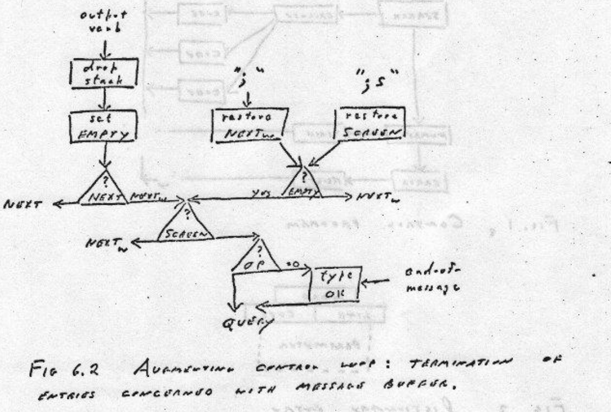

# v100 以後のタスク・仕様

## バグフィックス

* 10 . が 1になる。
* 101 . 11になる。
* 12001 . 121になる。
これを直す。

## 名詞と動詞(3.1)

* `@` スタック上のアドレスをその内容で置き換える。 
* `=` スタック上のアドレスに、スタック上のアドレスのすぐ下の値を入れる 


## 3.2 制御ループ

* パラメータスタックが限界を越えていないかのチェック
* 外部インタプリタの戻りポイントは２つ、
  + スタックを使用するルーチンのみチェックする
  + チェックする口としない口
  + ループの実行効率を追求するため
* エラールーチン
  + 「問題のあるワード」と「エラーメッセージ」を印字する。
  + (サブルーチンのリターン階層ごとにエラーフラグをチェックすることを避ける)
  + リターンスタックをクリアする(longjmp風)
  + 例1: ワードを間違えた→そのワード+"?"
  + 例2: 加算時にスタックに1引数しかない→そのワード+"LIMIT!"
* スタックの配置
  + パラメータスタックをリターンスタックにオーバフローさせる  
    →リターンスタックの後ろにパラメータスタックを置く
  + パラメータスタックをメッセージバッファにアンダーフローさせる  
    →パラメータスタックの後ろにメッセージバッファを置く


## 3.3 WORDの定義

## メッセージバッファ(3.3.1)

* 十分な長さを確保する←128byteとする。

## WORD (3.3.1, 3.3.2)

* バッファリングのエミュレーションを行う。
* バックスペース文字とキャンセル文字をサポートする。
* end-of-message wordを最後に置く
←EOM文字から成るワードを定義する必要がある。
これで何を行うのか不明。
* end-of-message word: OKというワードをタイプしてQUERYにジャンプする辞書エントリを持っている(6章)。
* 出力バッファ。複数のうちどれか一つでもバッファドであればすべての出力デバイスをバッファドとして扱うべきで、ノンバッファのデバイスではバッファドのエミュレーションを行う。
* 入力バッファと出力バッファは同じ領域を使用する。相互に排他的なはず。
* メッセージバッファがまだ入力を保持しているかどうかを表すフラグ(1bit)は必要だ。出力データを印字する際にはこのフラグをクリアする。
* `FETCH`: 入力ポインタが指す文字をロードしレジスタに格納し、入力ポインタを1つ進める。
* `DEPOSIT`: レジスタ中の文字を出力バッファに書き出し、出力ポインタを1つ進める。

## NUMBER (3.4, 3.4.1) 10進変換

`NUMBER`サブルーチンのガイドライン。

* 整数と負の整数は常に定義すること、
* 先頭のプラス記号を許容しないこと、先頭のプラス記号は数値としての意味を持たせないこと、かつ、ワードとしては使えること
* 浮動小数点ハードウェアがある場合は、小数点の有無で浮動小数点数を区別すること、
* 浮動小数点ハードウェアがないならば、小数点がある場合は固定小数点数とみなし、浮動小数点数シミュレーションをしないこと、
* 1未満の小数に指数をつけないこと、

## NUMBER (3.4.2)

`SIGNED`: 次の文字がマイナスかどうかをテストし、スイッチを設定し、これまでの数をゼロにして`NATURAL`に落ちます。

`NATURAL`: 文字を取得し、それが数字であるかどうかをテストし、これまでの数を10倍し、その数字を加算します。これは数字でないものを見つけるまで繰り返されます。

* まず`SIGNED`を呼び出す。その中で、
* 符号を表すスイッチを設定する。
* (`NATURAL`に流れる)整数変換を行う(この値が整数部分になる)
* `SIGNED`の停止文字が`.`ならば、再度`NATURAL`を呼び出し小数部分を変換する。
* 整数部分と小数部分を、最後に浮動小数点数または固定小数点数に変換する。  
  (固定小数点数の場合は、桁数を表す変数が別途あるはず)

> 桁数を表す変数の名前がまだ分かっていない

* 10進固定小数点数の桁数を表すフィールドは`D`だそうな。

## 数値出力(3.4.3)

* 10で割って余りを保存し、を繰り返す。
* いったんバッファに置く、保存場所はメッセージバッファの末尾、またはスタックでもよい。
* 最終的に`TYPEB`サブルーチンを使って数値を印字することができる。
* `TYPEB`サブルーチン: 文字列をスペースが出てくるまで出力する。スペースも合わせて出力する。
* `D`: 小数点以下の桁数を指定するフィールド、入力と出力で同じ桁数を使用する。
* `F`: 数値カラム幅を指定する(右寄せ出力の際のカラム幅)
* `SPACE`: 指定した数のスペース文字を印字する。負の値ならは出力ポインタを変更して後方に移動させる(ここ意味不明)
* tab entry (`TAB`?)

## スタック(3.5)

* リターンスタック: 余裕があればインデクスレジスタを割り当てるべき。8レベルもあれば十分
* パラメータスタック: 余裕があればインデクスレジスタを割り当てるべき。16レベルでは足りない。
* レジスタに余裕があれば、スタックトップを常時そのレジスタに取っておくと処理効率が上がる。
* トップワード、下位ワード: スタックの最上位2ワードを指す術語。

## 辞書(3.6)

* 辞書を一箇所に固めて置き、項目の形式を標準化することが重要です。
* ルーチン(機械語コード)それぞれにエントリを1つ割り当てること。
* IF ... ELSE IF 構文には、各エントリにルーチンを関連付けるという特徴があるということは重要(ここ意味不明、switch case 文の各case 節をそれぞれ辞書エントリ1つ割り当てるべきと言っているのか?)

### エントリの形式(3.6.1)

* 2つの方法がある、Mooreは2番目の方法をおすすめしている。
* エントリは可変長、一部は、コード、パラメータ、記憶領域となる。
* ワードフィールド: 1バイト目が長さ、2バイト目以後にそのワードの名前を持つ文字列。ワード(2バイト)アライメント。
* リンクフィールド: 2バイト、前のエントリ先頭を指すアドレス。上2ビットにフラグを用いる。よって辞書サイズは最大16kB
* コードフィールド: Moore師匠によると、コードのアドレスとあるが、今回は機械語コードを直接置いた。
* パラメータフィールド: 以下の4種類ある。
  + 数値、定数または変数: サイズは可変です。数値の性質は、そのエントリが実行するコードによって決定されます。 
  + 配列: 複数の数値が格納されるスペースです。配列のサイズはパラメータであるか、または実行するコードに含まれているかもしれません。 
  + 定義：仮想コンピュータの命令を表す辞書エントリの配列。3.9を参照してください。 
  + 機械語命令: プログラムによってコンパイルされたコードで、このエントリが実行される際にこのコードが実行されます。このようなデータは、おそらくワード境界でアラインされなければならないが、他はその必要はありません。

以下の方針で進める。

* 定数: コード`do_const`で、パラメータフィールドの先頭2バイトをスタックに積む。
* 変数: コード`do_var`で、パラメータフィールド先頭のアドレスをスタックに積む。つまり、変数のアドレスは、このワードエントリのパラメータフィールドである。
* 配列: コード`do_array`で、パラメータフィールド先頭2バイトが長さ、3バイト目以後が2バイト要素の列とする。`do_array`は配列の長さと先頭アドレスをスタックに積む。
* 定義: コード`do_list`で、パラメータフィールド先頭から2バイトずつ、他のエントリの先頭を指すアドレスの列である。列の最後は`do_exit`である。
* 機械語コード: コードフィールド先頭から機械語命令を並べてゆく。本ワードの機能を実行するコードです。最後はリターン命令でなく、`jmp do_next`である。

現在のところ、定義と機械語コードの辞書エントリのみ作成できる。`do_const`, `do_var`, `do_array`は今後実装する。

## 検索(3.6.2)

名前部分を可変長としているので、1バイト目を長さとしてワード比較を繰り返す。ここまでは既に実現できている。文字列末尾にスペースを置くかどうかまで考える。現在はスペースを置いていない。アセンブラのalign疑似命令に任せているので、おそらく0を詰められている。

現状のまま進める。後ろを読んで決める。多分仕様を変更することになる。

## 初期化(3.6.3)

制御ループに入るまでの処理を書く。当然すでにある。現状のまま進める。

## エントリの定義(4.1)

* ワード`ENTRY`: 次のワードを読み取り、そのワードをワードフィールドとする辞書エントリを作成する。コードのアドレスをパラメータとして渡す。パラメータフィールドを除くすべてのフィールドを作成する。

> コードのアドレスをどの形式で渡すか。現在は、機械語そのものを置いている。do_listならば、`jmp do_list`のジャンプ命令を置いている。`do_list`のアドレスを置いて、インナーインタプリタではさらにdereferenceするようにすべき。

* エントリの抹消
* `REMEMBER HERE`

## 演算(4.3)

* TRUEは1、FALSEは0
* 単項演算子
  * MINUS は top の符号を変更します。 
  * ABSは符号を正にします。 
  * ZERO は、top が0の場合、それを TRUE で置き換えます。さもなくば、FALSEをスタックに置きます。 
  * NONZERO は、top が 0 でない場合、TRUE をスタックに配置します。さもなくば、それをそのままにしておきます(FALSEをスタックに残します)。
* 二項演算子
  * \+ lowerにtopを足す。 
  * \* lowerにtopを掛ける。 
  * \- lowerからtopを引く。 
  * / lowerをtopで割って、商を残す。 
  * MOD lowerをtopで割って、余りを残す。 
  * MAX topがlowerより大きい場合、lowerをtopで置き換えます。 
  * MIN topがlowerより小さい場合、lowerをtopで置き換えます。 
  * \** lowerをtop乗する。

* 関係演算
  * = それらは等しいか?  
  * < topはlowerより大きいか?
  * \> topはlowerより小さいか?  
  * \>= は top が lower より大きくないか?  
  * <= top は lower より小さくないか? 

* 論理演算
  * NOT topがFALSEの場合はTRUEに、それ以外の場合はFALSEに置き換えます。 
  * OR 論理和演算  
  * AND 論理積演算 
  * IMP 論理包含(lowerが偽またはtopが真のときに真となる)  
  * XOR 論理的排他的論理和 

* 数値型ごとの演算
  * `+` 整数と固定小数点数の加算(これらは同じです)。 
  * `+F` 浮動小数点数の加算   
  * `+D` 倍精度の加算。

  68000版では浮動小数点数は使わない。`+`, `+D`のみ導入する。

## 定義エントリ(4.4)

* `:`. `;`エントリ
* `:`
  + アドレス`EXECUTE`を`ENTRY`サブルーチンに渡します。
  + スイッチ`STATE`をセットします。
  + (制御ループの変更) `STATE`が0であれば、すでに説明したようにワードが実行され、1であればワードがコンパイルされる、というように制御ループを変更する
  + ワードの実行の方の効率が良くなるようにする。
  + パラメータフィールド: ワードを辞書で検索し、このアドレスをパラメータフィールドに格納する。辞書に書き込むメカニズムは既に持っている(どれ?`DP`?)
  + パラメータフィールドに書き込むアドレスは、エントリ自体のアドレスを書き込む。コードのアドレスではない。

  > 現在はコードのアドレスを書き込んでいる。内部インタプリタも改造必要。

  > 0バイト目、文字列の長さフィールドのMSBを立てておく。これをもって辞書エントリトップとする。

  + `DP`: 辞書ポインタは辞書内の次に利用可能なワードを指す。`ENTRY`内部で使用する。

* リテラルのコンパイル(イミディエイト命令)
* よく使うリテラルはワードとして定義しておく(1 CONSTANT 1, とか、数字だけのワードができるらしい)

* ワード検索が数値変換より先に行われる。

> 数値の変換が行われる前に辞書が検索される

らしい。要変更。

* 作成中のエントリは検索対象としない。

> `:`で検索時に現在のエントリを検索対象から外す

## 定義を実行する(4.4.2)

* 仮想計算機の内部コードの変更:
  + `NEXTW`: 辞書エントリのアドレスを提供する。この後このアドレスを実行し、最終的には`NEXTW`に戻る。
  + `IC`: インストラクションカウンタ、定義の実行の際に「次に実行する(仮想機械の)命令を指すポインタ。
  + `NEXTI`: `IC`が指すエントリをフェッチし、`IC`を次のエントリに進め、`NEXTW`と同じポイントに戻ってエントリを実行(or コンパイル)する。
  + エントリを実行(コンパイル)するコードは、`NEXTI` のコードから流入し、`NEXTW` に飛び込むように作り、ジャンプ命令の分だけ節約するようにする。
* `EXECUTE`: `IC`の現在の値をスタックに保存し、`IC`に新しい値(おそらく実行対象エントリの先頭)を設定する。ある定義から他の定義を呼び出すときは、`IC`の値は有効な値だが、そうでない場合(最初の呼び出し)の時は無効な値を指す。
  + `NEXT`の値も戻す。スタックに保存してそれを戻してもよいが、ここでは、

> 現在の実装は、「ソーステキストに由来する定義を呼び出す際に、IPに次の番地を入れておく」「IPが指す先は機械語命令の並び(ポインタではない)」

## 条件文(4.4.3)

コンパイル時のみ使用する。

* `IF`: 条件付き分岐命令とパラメータ0を置き、パラメータ0のアドレスをスタックに置く。

> このスタックがパラメータスタックかどうかは明記されていない。ひょっとしてパラメータスタック？それはないでしょう？

* `ELSE`: 無条件ジャンプとパラメータ0を置く。`DP`の現在値をスタックトップが指す場所(`IF`の条件付き分岐命令のパラメータ位置)に格納する。スタックトップを捨ててパラメータ0のアドレスをスタックに置く。
* `THEN`: `DP`の現在値をスタックトップが指す場所(`IF` の条件付き分岐命令または`ELSE`分岐命令のパラメータ位置)に格納する。スタックをPOPする。

> と思ったら、

```
: HERE SWAP THEN ;  
: -IF NOT IF ;
```

> なので、データスタックにリターンアドレスを積むみたいだ。

## ループ(4.4.4)

```
BEGIN ... boolean END
```

* `BEGIN`: `DP`の値をスタックに積む、
* `END`: スタックの値が偽の場合に分岐せずスキップする疑似命令を置く。パラメータはスタックトップ(2番目)の位置に相対オフセットとして書き込む。

```
a b DO ... CONTINUE
```

回数指定のループ。a が b と同じ値になればループを抜ける。ループ制御構文内ではa, bの値を変更しない。

> チェックは`CONTINUE`側で行われるので、最低1回は実行される

* `DO`: スタックに`DP`の値を積む
* `CONTINUE`: スタックの上2個を比較し、等しい場合は抜ける。等しくない場合は後方にジャンプする。

> 上位2個を比較し、等しくない場合は分岐する(非破壊)。等しい場合は抜ける(2個POP)。

> インデックスaを1増やすのはループ内で明示的に記述する。
>
> Moore師匠オリジナルのForthでは、`FOR`ループ、ワード`I`, `J`はなかったということになる。

## 実装(4.4.5)

* 辞書エントリに1ビットの属性を設ける。
  + 1: 実行  
  + 0: コンパイル 

* `STATE`と"or"演算し、1であれば実行する。0であればコンパイルする。

* それでも、「通常のワード実行時にコンパイルする、命令的ワードはコンパイル時に実行したいワード」という原則に収まらないケースがある。
* Moore師匠はワード`:!`とワード`!`の組み合わせを説明している。「すべてのワードを強制的にコンパイルする」定義語`:!`と、「直前にコンパイルしたワードを実行し、コンパイル先から削除する」
* ただし、このやり方では、リテラルとしてコンパイルされた2ワードを実行することができない。最後にコンパイルしたワードが単長か2倍長かを判断する手段がないからである。よって、「リテラルを実行させることはできません。あきらめて下さい」という制約を受け入れざるをえないことになる。
* 命令後が単長か2倍長かを示すフラグを入れれば解決するが、そこまでするほどの問題か、という考えらしい。

> LISPのひそみに倣い、`QUOTE`だとどうだろうか。この後ろのワードを実行せず無条件でコンパイルする定義語を用意する。cmforthでは`\``を付けると後ろのワードを無条件にコンパイルしていたように思う。

### コードエントリ(4.5)

機械語エントリを作る方法。エントリヘッダを作る`ENTER`と、それを閉めて機械語を列挙するための `;CODE` 命令。ここでは使用しない。

### 5章

ディスクアクセスとエディタの説明がある。今回は実装しない。

## 6章

### 出力ルーチン(6.1)

* "名前どうしよう": ある数だけスペースを印字する。
* `TYPEN`: バッファ位置、文字数を渡すと文字を印字する。
* `TYPEB`: スペースに遭遇するまで(そのスペース含め)文字を印字するもの。ただし辞書エントリのワードを入力するため使えるように辞書形式に合わせる。
 
この３つ、入力はfetchを用いる。出力はdepositを用いる。

* エラーを発見した場合の処理: それまでやっていたことを中止し、スタックをリセットして、スタックを空にしておく。辞書のリセットは行わない。
* ユーザの入力を解釈実行する制御ループでは、ユーザ入力行を受け取ると`TYPEB`を使い現在のワードを出力する。このワードを実行時にエラーが発生すると、「どこでエラーが発生したかを通知する(文字位置かな)」、そのあと、`TYPEB`を使ってエラーを説明するワードを出力する。簡潔なメッセージとする。

### 応答(6.2)

* メッセージバッファを入力と出力で共有する。どちらか一方。
* `SEND`: メッセージ送信サブルーチン。１行送信後キャリッジリターンを出力する。
* `QUERY`: メッセージ受信ルーチン(サブルーチンではない)。
  + `SEND`を呼び出してメッセージを送信し、入力メッセージを待って処理します。
  + 制御文字を除去し、必要に応じて文字を変換します。
  + 入力ポインタ`IP`を初期化し`NEXTW`にジャンプします。
* End-of-messageワード: 非印刷文字1文字。`OK`を印字して`QUERY`にジャンプする。おそらく、入力行を読みバッファに置いたところで末尾にこの非制御文字を置くのだろう。当然^Z(0x1a)を使う。
* `OK` は入力メッセージと同じ行に表示され、最後のワードとは少なくとも1つのスペースで区切る。
* 入力完了でアクノレッジしない。解釈完了でアクノレッジとして`OK`を出力する。
* `EMPTY`: メッセージバッファに入力があるかどうかを保持する変数。`QUERY`はemptyをfalseに設定し、各出力生成エントリはそれをtrueに設定する
* 出力生成動詞の挙動: 
  + スタックを削除します。各出力動詞は引数を持つはずです。最後の引数はこの時点でドロップすることができ、スタックポインタは下限チェックされます.
  + `EMPTY`を真に設定します。 
  + `NEXT`が`NEXTW`を含み、`SCREEN`が0であれば、`QUERY`にジャンプします。 この状況では、メッセージバッファにそれ以上の入力はありません。 
  + `NEXT`にジャンプします。
* `SCREEN`はエディタの機能らしい。入力ソースがエディタバッファの場合は、`QUERY`に飛ばないようにするのだろう。
* 図6.2
<figure>

</figure>

### 文字列(6.3)

* 最初の文字を指すアドレスと文字数をスタックに置く。(どうやらこのペアを記述子と呼んでいる様子)
* `"`: 文字列の開始を表すワード。
* 文字列を入力する。スタック上の記述子を利用して`TYPEN`サブルーチン用にパラメータを設定するエントリ  
  ⇒ということは、これが`"`ワードの実コードになる？
* 文字列の移動、スタック上に2つの記述子がある。2つのうち小さい方の数の文字数をコピーする。移動先の後ろが余っている場合はスペースで埋める。

### フィールド出力(6.4)

* 変数を指す記述子、出力フィールド幅、フィールド名を参照できる。
* フィールド名は辞書エントリから得る。
* フィールドエントリは自身のアドレスをスタックに置く。
* `,NM` - フィールド名を印字します。 
* `F` - フィールド幅を取り出します。 
* `@F` - フィールドアドレスを取得します。 

> フィールド出力の項、意味がよくわからない。独自の実装？cmforthのソースコード調査のこと。

## 7章、マルチユーザ編


