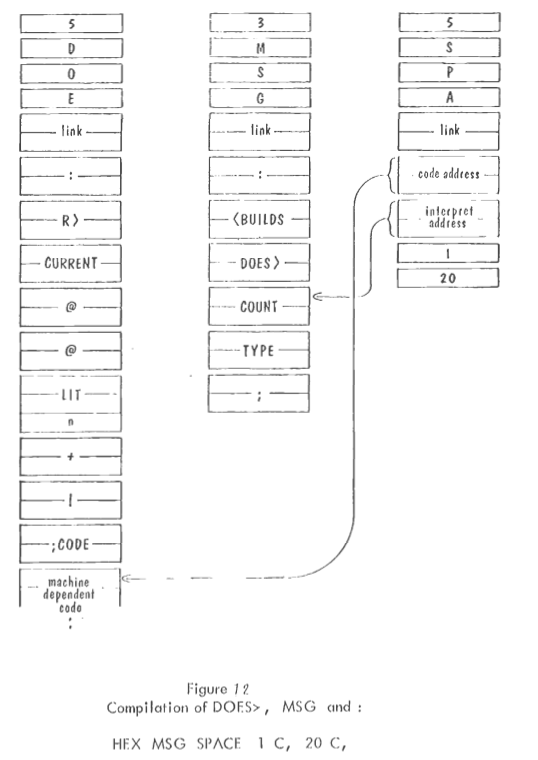
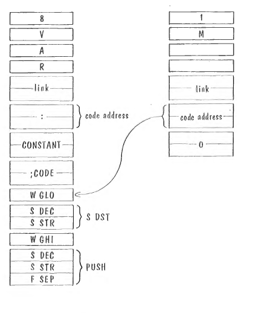

# v100以後の改版メモ

### '@', '!' fetchとdeposit

base.dict にエントリ2つを追加した。

### pop

base.dictのpopエントリに add.b #2,%a5を入れた。

### スタックアンダーフローチェック

narrowroad.sのdump_stackの最初でアンダーフローをチェックしてエラーメッセージを出した。

### putnum を直した(11/18)。

桁0だけ表示されないバグを直した。素直に下の桁からバッファに蓄え、最後にまとめて出力するようにした。divu.w命令を使った。上位16bitに余り、下位16bitに商が返される。

現在、signed short 16bitとして表示する(-32768 - 32767の範囲)。

linbuf末尾からASCII数字列を格納するようにしている。

### 数値出力: 10進固定小数点数

固定小数点数を使うときに実装しましょう。後送り。

### TYPEBルーチン

メモリ上のデータを空白が出るまで出力する。

### 現状のメモリマップ(11/20)

codes.sの先頭と、リンカスクリプト(`trip.ldscript`)による

機械語コード4kB, 辞書4kBを想定している。
```
0000-0FFF: リセットベクタ、割り込みベクタ、ほか
1000-1FFF: CODEセグメント、機械語コード
  code_top:
  ram_top:
2000-2FFF: DICTセグメント、base.dictをアセンブリコードに変換したdict.sが置かれる。
3000-FFFF: BUFFERセグメント
  linbuf:  3000-307F(128bytes)
  wordbuf: 3080-30FF(128bytes)
  putnumbuf: 3100-310F(16bytes)
    これはwordbufの末尾16バイトでも構わない。
FC00-FEFF: STACKセグメント
  data stack:   FC00-FCFF(%a5)
  return stack: FD00-FDFF(%a6)
  assembly stack: FE00-FEFF(%a7)
```

### 辞書エントリ追加(11/20)

@は奇数アドレスの時バスエラーを起こす。
C@, C!を追加した。バイトアクセス

### word定義、辞書検索がうまく働いていない(11/20)。

* 起動直後、cr, blは動作する。
* add呼び出し→add not found, 以後cr, blともにnot foundとなる。
  add,abc呼び出し後もだめ。inner interpreterが動作していない様子。デバッグ必要。
* abcが動作しない。nop not foundが出る。

調査の結果、

* 偶数長の比較がおかしい。文字列は先頭に長さ、２バイト名後に文字列データを置く。高速化のためword比較なので、偶数長の場合、末尾１バイトに何を詰めるかまでコントロールせねばならない。
* Moore師匠によれば、
  + 行入力からワードを切り出すWORDルーチンでは、文字列の次の空白文字までバッファに置くようにする。
  + 辞書エントリの文字列も、詰め文字は空白文字とする。

番兵、ですね。

今は計算機資源に余裕があるので、数10命令増えようが「文字列の意味を忠実に実装する」のですが、当時はこういう技をよく使いました。

### word定義・検索関連の修正(11/26)

ということで、以下の修正を施しました。

* 辞書エントリの文字列長さが偶数の時、文字列末尾に空白文字を追加した。偶数バイト長のとき、先頭の文字数１バイトも含めてワードアライメントで次のデータを置くと１バイト空きがでる。この１バイトが従来バイト0だったのを、空白文字を置くように辞書コンパイラを修正した。
  + do_same: 文字列比較時のワード数カウンタ初期化を修正した。というかもともと間違っていた。  
  + do_same: %d0へのバイトリードのあと、bit8-15のクリアをしていなかった。ここ68kアセンブリで要注意。`eor.w #0,%d0`を追加。

```
    +2    ÷2
  1 --> 3 --> 1
  2 --> 4 --> 2
  3 --> 5 --> 2
  4 --> 6 --> 3
  5 --> 7 --> 3
  ...
```

  + makedict.sh: awkスクリプトでアセンブリ命令列を出している。文字列は`.ascii`疑似命令で出しているが、偶数文字の文字列は末尾に' 'を追加した。
  + acceptルーチン: 行入力ルーチン。読み込み完了(`\r`検知)し、戻る前にバッファ末尾に無条件に空白文字を足した。乱暴だが。
  + dictdump.c: デバッグ用の辞書ダンプリスト生成用のプログラムも辞書エントリの文字列部分の長さ計算を修正した。

### その他の修正(11/26)

* 辞書エントリ: `base`を追加。数値出力の基数を格納する変数のアドレスをスタックに置く。`!`, `@`と組み合わせて使用する。まだ動作している感じがしない。デバッグ要。
* 辞書エントリ生成: 空の`dc.w`疑似命令が出ていた。理由は謎。とりあえず`dc.w`のオペランド文字列が空の時には生成しないようにした。乱暴。
* ブレークポイント機能: アセンブリ言語ソース中に `br[0-9][0-9]*`(b,r,数字)に一致するラベルがあれば、そのラベルすべてをブレークポイントとみなすようにした。
  + ソースコード中でブレークポイント入れたいところに`bp000:`と書く。`do_same`ルーチンにブレークポイント入れるときはこんな感じで。

```
do_same:
bp000:
    move.w  %d1,-(%a7)      /* push %d1 */
    move.w  %a1,-(%a7)
    move.w  %a0,-(%a7)
```

  + `extract_bp.sh`: 生成後のオブジェクトからシンボルリストを出し、そこに`br[0-9]`に一致するシンボルがあれば、そのアドレスを`PXXXX`の形式で出力する。この出力を `bp.X`ファイルとして保持し、ターゲットにアップロードする。
  + 68000エミュレータMusashi: 複数引数でアップロードファイルを指定できるように修正。
  + 実行時: `./sim narrowroad.X bp.X`と2ファイル指定して呼び出す。
* シングルステップ機能: Musashiに追加、ブレーク停止中はレジスタダンプしてキー入力待ちになる。スペースを叩くとワンステップ、`.`を入力すると実行再開。

### バグか？baseを変更後、2度目のbaseが読み込めない。

```
;
run...]16 base !
]base

se not found
00BA ].
BA]
```

`16 base !`で基数を16に切り替えたのち、`base`に値が正しく設定されているかどうかを確認しようと`base`と入力した。すると、`se not found`と出てスタックに`BA`が置かれた。なんで？

辞書引き、ワード切り出しの不具合を疑いトレースした結果、この挙動は「期待通り」(もしくは「書いた通り」)であることが分かった。すなわち、

* 基数を16としたことで、`A`, `B`は数値となる。
* なので`base`は数字から始まっていると見なし、`ba`を16進0xbaと見なしてスタックに`BA`を載せる。
* 次の文字`s`で数値でないと見なして数値変換(do_number)を抜けてワード検索に移動する。
* 残り2文字`se`を切り出して辞書検索に入り、`se not found`となった。

だった。だがこの挙動は許容できない。設計がおかしい。

baseは16進文字から始まっているが、ワードとして見ると16進数ではないだろう。現状は、数字文字なら数値に変換してゆくが、まず空白文字でワードを切り出してから変換すべきではないか。うーん、そういえばMoore師匠はnumber, wordをしっかり作れと言っていたなぁ。師匠の教えに立ち返ってみよう。

再度、Moore師匠の教えに立ち返ると、8.1 ワードの解剖(word dissection)にそれらしいことが書いてある。

> 以下の文字列全てがワードとなるような単純なルールはない。  
> * HELLO GOOD-BY 3.14 I.B.M. -.5 1.E03  
> 同様に、以下の文字列を意図するワードに分離する単純なルールもない。  
> * -ALPHA 1+ ALPHA+BETA +X**-3 X,Y,Z; X.OR.Y  
> 遅くなるが「スペースで終わるワードを読み、辞書を引き、数字に変換する。この定義でワードでない場合は、最後の文字を削除して再試行します。最終的には残った文字がワードとなるように、十分な文字を削除する。

要するに、
* 現状は、「数値変換、ワード切り出しと検索」、の順に処理しているが、
* これを「ワード切り出し、辞書検索、数値変換」の順に変える。
* 数値にもならないなら末尾1文字を削除して再度回す。

ということだ。ここでも、まずワードを切り出すと言っている。

とりあえず、「ワード切り出し、辞書検索、数値変換」に変更することにする。

### outer ループ組み換え(11/26)

組んでみた。当然だが動かない。
```
;
run...]1
0001 ]2
0001 0002 ]+

N not found
0003 ]pop
```
`N not found`が出るが、1 + 2 は実行できている。
```
0003 ]pop

 ]1Attempted to write 31 to RAM address 00fe3000
At 133a: move.b  D0, (A1,D1.l)
```
`pop`を入れるとプロンプトを返すが、1文字`1`を入力した時点でシミュレータが堕ちる。
```
kuma@LizNoir:~/narrowroad-m68k$ ;
run...]1 2 + .
0001 ]
```
1行に複数ワードがある場合そもそも続きを解釈しない。

### outerループデバッグ(11/27)

* `At 133a: move.b D0, (A1,D1.l)`の件、accept入り口でD1(バッファ長)の値がおかしい。FFFE0080になっていた。
* 呼び出し側で%d1への定数セットで`move.w`を使っていたので上16ビットが初期化されていなかった。`move.l`にして問題なくなった。
* move.wで上が初期化されていない、move.bでビット8-15が初期化されていないという失敗が多い。とりあえず気を付けるとして、それ以上の防止策はどうする？ 

* 上記を修正後、`pop`でプロンプトに帰ってこない。
* acceptからは帰ってきている。
* findの終わりにブレークポイント掛けると、何度も辞書検索している。
* 2度目のfindから、%a0(wordbuf)の指定が違っている。違うバッファからワードを見て検索していた。
* outer ループでコマンド実行後に行入力ループに戻る際に、レジスタのpopができていなかった。pop3個を追加すると動くようになった。

### バグかも？(11/28)

```
run...]16 base !
]base !
underflow]A base !

A not found
]base

 3400 ]@

 0000 ].
Attempted to write 0000 to RAM address 00fffffe
At 02d6: move.l  D4, -(A3)
kuma@PC-C2387:~/narrowroad-m68k$
```
もう1回、今度はいきなり`base !`でアンダーフローを起こしてみる。
```
;
run...]base !
underflow]base
3400 ]@
0000 ].
]
```
変数`base`が0になっているらしい。

数値を表示`.`する際には`base`で割るため、ゼロ除算が生じているはず。現状、このエクセプションはキャッチしていないため、何が起こるかわからない状態。

* そもそも`!`でアンダーフローを起こした場合書き込みされているのが問題か？
* `!`の実行時に毎回スタックアンダーフローチェックするのはよろしくない。実行効率低下が心配だ。アウターループに戻ってくる際にチェックする、でいいはず。
* `base`を参照するときにゼロかどうかをチェックするか。これも微妙だが。

* いずれにしても、ゼロ除算のエクセプションは、バスエラーエクセプションとともに組み込んでおくべきですね。これらのエクセプションが生じると、スタックをクリアしてouter loop 先頭に戻る。
### Exception対応追加(11/28)

* Illegal Instruction/Bus Error/Div by Zero に対してException ベクタ追加。
* Exceptionベクタ`do_exception`では、メッセージを表示して初期化ルーチンに飛ぶ。
* 初期化は、%a7(SP), %a5(DSP), %a4(RSP)に対して行う。
* メモリ上変数は初期化されない、以前の状態のまま。

#### ベクタテーブル

* bus error とその他例外を設けた。

```
    .section VECTOR_TABLE
    dc.l    sp_end          /* 0: Initial SP */
    dc.l    start           /* 1: Initial PC */
    dc.l    do_exception    /* 2: Access fault */
    dc.l    do_buserror     /* 3: Address Error */
    dc.l    do_exception    /* 4: Illegal Instruction */
    dc.l    do_divbyzero    /* 5: Divide by Zero */
```

#### 例外処理ルーチン

* アドレスをダンプした後メッセージを出す。
* アドレスは%sp +2 のダブルワード

```
    .section CODE
buserror_str:
    dc.b    9
    .ascii  "bus error "
exception_str:
    dc.b     9
    .ascii  "exception "
divbyzero_str:
    dc.b    14
    .ascii  "divide by zero "
do_divbyzero:
    move.l  #divbyzero_str,%a0
    bra     do_exception_message
do_buserror:
    move.l  #buserror_str,%a0
    bra     do_exception_message
do_exception:
    /* exception ... rewind SP, IP, DSP, RSP */
    move.l  #exception_str,%a0
do_exception_message:
    jsr     (putstr)
    jsr     (bl)
    add.l   #2,%a7
    move.l  (%a7),%a0         /* access address */
    move.l  %a0,%d0
    jsr     (puthex8) 
    jsr     (crlf)
    /* falling down to start */
start:
    ... (この先で%a7,%a5,%a4が初期化される)
```

### IF/ELSE/THENとループ導入: Part1 仮想命令(ブランチ)の追加(11/30)

ワードコンパイル導入に先立ち、必要なワードを追加してゆく。ワードリストの要素は、通常実行ルーチンのアドレス(ジャンプ先)だが、「そのワードを取り出してそこへジャンプする」以外の処理が必要になる。ここではその「命令」3つを挙げる。

* `lit`: リテラル、次のワードの値をスタックに積む。数値をコンパイルするとき生成されるコードに埋め込む。

```
do_lit:
    move.w  (%a6)+,%d0          /* next word to %d0, immediate
                                   operand of 'do_lit' */
    move.w   %d0,-(%a5)         /* push it to Data Stack */
    bra.b   do_next
```

* `bra`, `bne`: 無条件ブランチと条件付きブランチ。
* `bne`はスタックの値がfalseの時にジャンプする。`IF/ELSE/THEN`で、true節とfalse節の飛び越えに用いる。ワードIFのコンパイルの際に、`bne`をtrue節の前に置き、あとでELSE/THENに出会ったときにその位置へのジャンプ(IPにそのアドレスをセット)する。
* `bra`はtrue節の最後に置き、あとでfalse節の最後のアドレスが確定した時点でここにジャンプ先を置く。
* ループを組むときにも用いる。

```
    .global do_bne
do_bne:
    move.w  (%a5)+,%d0
    and.w   %d0,%d0
    bne.w   do_bra
    add.w   #2,%a6
    bra.w   do_next

    .global do_bra
do_bra:
    add.w   (%a6)+,%a6
    bra.w   do_next
```

辞書エントリの定義の中で、`lit`, `bra`, `bne`と書くことができる。例えば、スタックトップがゼロの時 `false`を、非ゼロの時 `true`を印字するワードの定義は、以下のように書くことができる。litの次には定数を置く。数値か、アドレス(`#false_str`など)を書く。

`bne`, `bra`の後ろには相対オフセットを書く。オフセットの次のアドレスを起点として符合付き2バイト整数として計算する。

例えば、`bne 12`は、次の命令/オフセット6個を飛ばし7個目に条件ブランチする。

```
word branch
    bne
    12
    lit
    #false_str
    types
    cr
    bra
    8
    lit
    #true_str
    types
    cr
    endword
```

* 条件ワード: 比較演算子の類、スタックの上2ワードに適用する2項演算子。true(1)/false(0)をスタックに置く。`0=`, `0<`, `<`, `>`, 

プログラマが打ち込むプログラムでは使わない。辞書エントリとしては存在しないが、終了時 next/exitにジャンプする。


### 解説: 辞書エントリ

辞書エントリは、
* ヘッダ(名前文字列とprecedenceフラグ)
* 一つ手前のエントリへのリンク
* コード部(CFA)
* パラメータ部(PFA)

から成る。

エントリの本質は、
* 名前、
* ワードのリストか機械語ルーチンの区別
* 機械語ルーチン
* リスト本体(ワードのリストの場合)

であり、これを指定する記述を以下のように決めた。

ワードのリストの場合
```
word <name> <opt-name> <precedence-flags>
   ...
   ...(list of words, routines)
   ...
   endword
```

機械語ルーチンの場合
```
code <name> <opt-name> <precedence-flags>
    ...
    ...(machine codes)
    ...
    endcode
```

#### *\<name>*:
ワードの名前、アルファベット・数字だけでなく、空白文字以外の任意の印字可能文字を使用できる。ただしASCII文字に限る(0x21-0x7f)。  

エントリ先頭の文字列として置かれる。Forth言語でワードを打ち込んだ時マッチング対象となる文字列である。  

文字列長さの上限は31文字まで。文字列を長さ⁺ASCII文字列で表現しているが、長さ1バイト中3ビットをエントリ属性(優先度フラグなど)として使うことを想定して、5ビットで表現できる範囲の長さとした。

#### *\<opt-name>*:
オプションの名前。アセンブリ言語のラベルとして使用される。

`<name>`がラベルとして使用できない文字を含む場合、このオプション名でラベル名を指定する。

#### *\<precedence-flag>*:

優先度フラグ情報。`immediate`または`level2`

(Moore74の13章より)
> FORTHコンパイラはそれ自体がFORTHで書かれているので、コンパイル中の言葉とコンパイラへの命令としての言葉を区別する方法がなければなりません。優先順位フィールドはこれを行う。これは、ある語がコンパイル中に実行されるかどうかを指定するものである。表1は、エントリの優先順位と変数STATEの値によって、ワードがいつコンパイルされ、いつ実行されるかがどのように決まるかを説明しています。
>
> ほとんどの単語は優先順位が0であり、普通にコンパイルされる。しかし、一部の単語、特にIF, ELSE, THEN, DO, LOOP, ';'はコンパイルが困難なため、コンパイル中に実行しなければならないという問題が生じる。これらの語はコンパイラ指令であり、定義の外側では使ってはいけません。ほとんどの指令は優先順位が1です。
>
> しかし、FORTHの性質上、さらに複雑なことが起こります。コンパイラ指令を定義できるようにするためには、コンパイラ指令さえもコンパイルされる状態を定義しておく必要があるのです。これは、IMMEDIATEという指令で、現在のエントリの優先順位を1にし、変数STATEも2にします。これで優先順位1の指令もコンパイルされるようになりますが(表1参照)、それでもコンパイルを止めるために実行しなければならない単語があります。というわけで、';'は優先順位2になっています。

`immediate`は、このワードを優先度1にする。具体的には先頭の文字列長さバイトのbit5(6ビット目)を立てる。`level2`は、優先度を2にする。bit6,5を1,0とする。Moore74によると、ワード定義の終端`;`(セミコロン)がそれに該当する。

> 未実装、実装次第コードを入れる

### ワード先頭バイトのビット7は立てておく

ワードリストは、各ワードの途中のアドレスを指している。具体的には、先頭の文字列、リンクの次のアドレスである(CFA Code Field Address)。

デバッグの都合上、ワードリストの各要素のワード名を印字したいことがある。ワード名文字列の先頭を探すために、バイトMSBを立てることで識別する。

* 名前はASCII文字列であること。
* 長さは5ビット、31文字までであること。
* 優先度に2ビット使うこと。

により、リンク領域(これは2バイトの固定長)を飛ばして逆方向にワードサーチを掛ける際に、ワードMSB(68000なのでビックエンディアンなのです)が1を見つけるだけでよいことが分かる。

### 生成されるアセンブリ言語のコード(ワードエントリ)

「辞書記述言語(?!)」で記述されたファイルをシェルスクリプト`makedict.sh`でアセンブリ言語の記述に変換する。採取的なバイナリは、初期化・サービスルーチンを記述する`codes.s`と、辞書コードをアセンブリして完成させる。

例えば、以下のようなワード定義`ttest`は、

```
word ttest
    lit
    #true_str
    types
    endword
```

以下のようなアセンブリ言語に変換される。

```
entry_024:
e_ttest:
    dc.b    5
    .ascii  "ttest"
    .align  2
    dc.w    entry_023
do_ttest:
    jmp     do_list
    dc.w    do_lit
/* str = #true_str */
    dc.w    true_str
    dc.w    do_types
    dc.w    do_exit
```

ラベル`e_ttest`から`do_ttest`までの間がヘッダ部分、名前文字列と前のエントリへのリンクである。

* ヘッダ先頭バイトは名前文字列の長さである。
* 2バイト目から名前文字列がASCIIコードで置かれる。ワード(2バイト)アライメントとする。
* その次が、「前のエントリへのリンク」である。各エントリ先頭には、`e_<name>`形式のラベルだけでなく、`entry_nnn`形式のラベルも定義され、次のエントリのリンクフィールドに前のエントリのラベルを置けるようにしてある。

ラベル`do_ttest`から後ろがコードフィールドとパラメータフィールドである。

* ワードエントリの場合、コードフィールドは、ルーチン`do_list`へのジャンプ命令である。  
  この機械語ルーチンでは、IPの値をリターンスタックに保存したあと、ジャンプ命令の次からのワードCFAアドレスのリストの先頭をIP(レジスタ`%a6`)に設定し、内部インタプリタ`do_next`にジャンプする。
* 参考までに`do_list`のリストを以下に示す。

```
/*
 * inner interpreter
 */
    .global do_list
do_list:                        /* %a0 points to the code of the word, 
                                 * where it has address of 'do_list' */
    move.w  %a6,-(%a4)          /* push IP */
    move.w  %a0,%a6             /* address points to the code area of new word
                                 * IP now points to the address of the first pointer */
    add.w   #6,%a6              /* IP points the first token address
                                 * the size of `jmp do_list` is 4 bytes
                                 */
    jmp     do_next
```

* 以後はワードのCFAアドレスが並ぶ。各エントリのCFAアドレスは、ラベル`do_<name>`で定義されているので、このラベルの値を並べることでリストができている。
* 最後にルーチン`do_exit`のアドレスが置かれる。  
  `do_exit`は、`do_list`と対をなすルーチンで、`do_list`で保存したIPを取り戻し、  
  IPがさすアドレスに間接ジャンプする。飛び先は「このワードの呼び出し元のワードリスト上で次のエントリのCFA」である。ややこしい。

```
    .global do_exit
do_exit:
    move.w  (%a4)+,%a6          /* pop IP from RSP */
    move.w  (%a6),%a0
    add.w   #2,%a6
    jmp     (%a0)
```

### 生成されるアセンブリ言語のコード(ワードエントリ)

* 機械語(コード)エントリの場合は、直接アセンブリ言語が記述される。

* 例えば、スタックの上2ワードを加算しスタック上に戻すワード`+`の定義は以下のように書く。  
  `code` ... `endcode`の間には68000のアセンブリ言語コードをそのまま書く。

```
code + plus
    move.w  (%a5)+,%d0
    add.w   (%a5)+,%d0
    move.w  %d0,-(%a5)
    endcode
```

* 生成されるアセンブリ言語は以下のようになる。

```
entry_009:
e_plus:
    dc.b    1
    .ascii  "+"
    .align  2
    dc.w    entry_008
do_plus:
    move.w  (%a5)+,%d0
    add.w   (%a5)+,%d0
    move.w  %d0,-(%a5)
    jmp     do_next
```

* 名前`+`はラベルとして使えないので、オプションの名前`plus`を指定しており、これがラベル`e_plus`, `do_plus`に使用される。その後ろにエントリ内部で指定したアセンブリ言語コード3行が並び、最後は`jmp do_next`である。
* 機械語ルーチンの中ではIPは触らない。このエントリを呼び出した元のワードリストの次の要素を指している。この場合、単純に「IPの指すエントリを実行しIPを2足す」だけ行うので、まさに`do_next`そのものである。

### precedenceビットの実装

* 辞書エントリ先頭1バイトの上位3ビットと下位5ビットに分ける。
* 文字列長さは下位5ビットのみ、上位3ビットはマスクして落とす。
* 最上位ビットは常に立てる。CFAアドレスからエントリ先頭の文字列を見つけるためのサーチで使用する。文字列を形成するバイトのMSBは立ててはいけない。日本語文字ダメよ。

実装

* `do_same`で、文字列先頭の上位3ビットをクリアして比較するようにした。
* `do_find`で、エントリ先頭アドレスからリンクポインタを手繰る時の文字列長に0x1fマスクを掛けるようにした。

### 現在の状態`STATE`とワードのprecedenceとの関係

|situation|STATE|0|1|2|
|--|--|--|--|--|
|実行中|0|execute|execute|execute|
|コンパイル中|1|compile|execute|execute|
|IMMEDIATEの直後|2|compile|compile|execute|
||||||

この実装は、コンパイル実装時に実装される。

### リターンスタックは Moore74に記述がある。

リターンスタックは Moore74に記述がある。よって、我々の narrowroad Forth インタプリタも2スタックで行く。

### 辞書関連、スタック操作(11/30)

`HERE` ... 辞書の末尾、次にエントリを置くアドレスを返す。`here`という名前の変数としての扱い。

```
code here
    move.w  (here_addr),-(%a5)
    endcode
```

`LAST` ... 最終エントリ変数のアドレスを返す。`last @`で最終エントリのアドレスを得る。

```
code last
    move.w  #last_addr,-(%a5)
    endcode
```

`WHERE` ... 最終エントリの名前を印字する。`last`で得たアドレスの指す場所に最終エントリのアドレスがある。エントリの先頭は名前文字列なので、それを`types`で印字する。

辞書エントリ先頭も上位3ビットクリアする必要があるが、2項演算子がまだ実装されていないので無理。

```
word where
    last
    atfetch
    types
    endword
```

### 論理演算子を実装する。

`AND`, `OR`, `XOR`である。popは一つだけで、あとはスタックトップを入れ替えるだけである。

```
code and
    move.w  (%a5)+,%d0
    and.w   %d0,(%a5)
    endcode
code or
    move.w  (%a5)+,%d0
    or.w   %d0,(%a5)
    endcode
code xor
    move.w  (%a5)+,%d0
    eor.w   %d0,(%a5)
    endcode
```

`NOT`は、非0のとき0, 0のとき1にする。

```
code not
    move.w  (%a5),%d0
    and.w   %d0,%d0
    beq     xcode_1
    move.w   #-1,%d0
xcode_1:
    add.w   #1,%d0
    move.w  %d0,(%a5)
    endcode
```

> ちなみに、このコードワード定義で`makedict.sh`は、「`code`から始まる行はエントリ開始とみなす」ので、最初ラベルに`code_1:`を使っていてハマった。とりあえず`code`から始まるラベルは使わないことで回避した。あと、`code`エントリでラベルを想定していなかったので、ラベルの場合(末尾が`:`の行)は先頭の4スペースは入れないようにした。

#### `TYPE0`: (addr n -- ) 文字列アドレスと文字数から印字する。

`%d1`にバイトカウンタとして使う。演算全て`.b`で行うと上位ビットに関わりなく計算できる。あたりまえだが。

```
code type0
    move.w  (%a5)+,%d1
    move.w  (%a5)+,%a0
    cmp.b   #0,%d1
type0_1:
    beq     type0_2
    move.b  (%a0)+,%d0
    jsr     (putch)
    add.b   #-1,%d1
    bra.b   type0_1
type0_2:
    endcode
```

#### `where`: 辞書エントリ先頭のMSB立てたバージョン

`type0`を使う前提で、辞書エントリ先頭のバイトカウントの上位3ビットをクリアしてカウンタとして使う。

```
word where
    last        // 最終辞書エントリの先頭アドレス
    atfetch     // を取り出しスタックに乗せる
    dup
    lit
    1
    add         // アドレスを1足して文字列先頭を指す
                // ようにする。
    swap        // それをプッシュして
    bytefetch   // 文字数カウンタを取り出し
    lit
    31          
    and         // 0x1fでANDする(上3ビットをクリアする)
    type0       // これでスタックトップが(addr n)になった
                // のでtype0を呼び出す
    endword
```

### 辞書エントリ生成をワードリストで書いてみよう

"Starting Forth"にこのあたりのワードの説明があった。

#### `CREATE`: 辞書エントリの作成

* 入力からワード1つを読み込み、そのワードを名前として持つエントリを作る。
* エントリは辞書の末尾(`HERE`, 実際は変数`H`の値)に置く。名前文字列の後ろにリンク(`LAST`の値を取り出しリンクに入れる)
* 辞書領域にデータを置く際には、`H @`(or `HERE`)で置き先のアドレスを得て、`ALLOT`で`H`を進めるという記法を用いる。

という仕事を行うワードが`CREATE`である。スタック上にPFA(CFAの次のアドレス)を置く。

narrowroad Forthインタプリタの場合、CFAが不定長なので、リストの場合のジャンプ命令を仮置きしておく(3ワード)。

辞書領域にデータを置く際には、`H @`(or `HERE`)で置き先のアドレスを得て、`ALLOT`で`H`を進めるという記法を用いる。

#### `PAD`: 文字列保持用のワークエリア

"Starting Forth"では、HEREの34バイト先となっている。辞書エントリが増えるにつれ`PAD`も先に進む。Moore74にはそういう話がない。行入力バッファの末尾を使えばよいとされている。

#### `S0`: スタックの底

Starting Forthでは、

* スタックポインタ初期値+2。スタックアンダーフローすると爆撃される。
* 入力メッセージバッファとして使う。

現実装は、

* 固定領域、辞書の後ろに十分スペースを置いて、128バイト長さのバッファを確保している。

#### `'S`: tick-S, スタックポインタの値(データスタックポインタ)

#### `>IN`: 入力ストリームの現在位置へのポインタ

linebufの現在読み込み位置がワードで見られる

#### `'`(tick): 入力ストリームの次のワードを辞書で検索する

* `do_find`を呼び出せばよい。定義中に記載しても入力ストリームから読み込もうとする。
* 見つからなければ `ABORT"` を実行する。

#### `[']`: コロン定義中で次のワードのアドレスをリテラルとしてコンパイルする

#### `WORD`: 入力ストリームから単語の切り出し

```
(char  -- addr)
```

入力ストリームから char で区切られる文字列を切り出し、addr にカウント付き文字列としておく。辞書定義で使うことが多いので、`HERE`上に置くことになる。

#### `SPACE`, `BL`

* `SPACE`: 空白文字を印字する。
* `BL` : 空白文字(10進数で32)をスタックに置く。

BLの定義が違うので変更すべき。

```
code space
    move.b  #' ',%d0
    jsr     (putch)
    endcode
code bl
    move.w  #' ',-(%a5)
    endcode
```

#### `INTERPRET`: outer interpreterをワード列で定義しなおす

* `FIND`: 入力ストリームからワードを切り出し、辞書を検索する。見つかれば辞書エントリのアドレスを返す。なければゼロを置く。  
  `(  -- a | 0)`
* `_find`: (小文字findの代わりに先頭にアンダースコアを付ける) ...
  `(a va --- ca na or a 0)`　`va`にある辞書を文字列`a`で検索する。
* `WORD`: 入力ストリームからワードを切り出し、`PAD`に置く。

```
word interpret
_interpret1:
    find
    bne
    #_interpret3:
    /* put a number on the stack */
    number
    /* if success, go to top of the loop */
    beq
    #_interpret1
    abort
    /* else, abort it */
    lit
    #abort_message
_interpret3:
    /* find it, now execute it */
    /* get cfa */
    dup 
    c@
    add
    lit
    2
    add
    /* now get cfa, ok jump it */
    execute
    bra
    #_interpreter1
    endword
```

> 12/1現在、未実装。

### 12/1のコミット実装

codes.s: 辞書エントリ先頭バイトのMSB ON対応。
  あちこちで and.b 0x1fしまくる。
  あと、dump_entryの後ろの断片コードを整理(削除)

base.dict:
* where書き直し, 辞書エントリ先頭のMSB ON対応。かなり膨らんだ。
* 論理演算子、and, or, xor, not追加
* type0追加。(addr n --), 文字列先頭とカウンタを載せて呼び出す形式。
* codeエントリでラベルを使えるようにした。
  但し`code`で始まるラベルは依然として使用できない

dictdump.c:
* 辞書エントリ先頭のMSB ON対応。これ抜きでは辞書エントリをディスアセンブルできなかった。

makedict.sh:
* 辞書エントリ先頭のMSB ON対応。
* //コメント対応(コメント部分を削除する)
* codeエントリでラベルを使えるようにした

### 12/2の差分

base.dict:
* テストエントリ削除、動作は安定し十分エントリ例が増えた。
  辞書を整理してすっきりさせておきたい。

### 四則演算子(12/2)

* `+`, `-`, `*`は問題ない。
* `/`は少し難しい。
  * 被除数`%d1`は32ビットなので、符号付き16ビットの値を32ビットに符号拡張しないといけない。
  * BFEXTS命令は68020以上でしか使えない。68000ではtest/braを使う。
  * and命令で符号ビットNに反映される。bpl/bne条件付きブランチを使う。

```
code / div
    move.w  (%a5)+,%d0
    move.w  (%a5),%d1
    and.w   %d1,%d1
    bpl     div_1
    or.l    #0xffff0000,%d1
div_1:
    divs.w  %d0,%d1
    move.w  %d1,(%a5)
    endcode
```

### 辞書エントリアセンブラを書こう(12/2)

疑似命令 `lit`, `bra`, `bne`のオペランドを同じ行に掛けるようにした。
また、`bra`, `bne` のオペランドとしてラベルを使えるようにした。 

今までは、`bra`, `bne`のオペランドを行数を数えて手計算する必要があったが、これでアセンブリ言語風にラベル定義とオペランドにラベルを書くことでオペランドを計算してくれる。

これで辞書エントリがアセンブリ言語風に掛けるようになった。

```
word branch
    bne  bra_1
    lit  #false_str
    bra  bra_2
bra_1:
    lit  #true_str
bra_2:
    types
    cr
    endword
```

* makedict.sh により、辞書アセンブリファイル`base.dict`からアセンブリ言語ファイル`dict.s`が生成される。
* `dict.s`をアセンブルし`dict.o`を生成する。これと、`codes.s`をアセンブルして得られるオブジェクトファイル`codes.o`をリンクし、`a.out`が生成される。
* `a.out`内のオブジェクトコードを16進ダンプし、アップロード用形式`narrowroad.X`, ブレークポイントは`bp.X`ファイルに変換する。
* `narrowroad.X`, `bp.X`をアップロード後runすればよい。

### 辞書エントリのデバッグ手順

### 辞書エントリ生成をワードリストで書いてみよう

"Starting Forth"にこのあたりのワードの説明があった。

#### `CREATE`: 辞書エントリの作成

* 入力からワード1つを読み込み、そのワードを名前として持つエントリを作る。
* エントリは辞書の末尾(`HERE`, 実際は変数`H`の値)に置く。名前文字列の後ろにリンク(`LAST`の値を取り出しリンクに入れる)
* 辞書領域にデータを置く際には、`H @`(or `HERE`)で置き先のアドレスを得て、`ALLOT`で`H`を進めるという記法を用いる。

という仕事を行うワードが`CREATE`である。スタック上にPFA(CFAの次のアドレス)を置く。

narrowroad Forthインタプリタの場合、CFAが不定長なので、リストの場合のジャンプ命令を仮置きしておく(3ワード)。

辞書領域にデータを置く際には、`H @`(or `HERE`)で置き先のアドレスを得て、`ALLOT`で`H`を進めるという記法を用いる。

#### `PAD`: 文字列保持用のワークエリア

"Starting Forth"では、HEREの34バイト先となっている。辞書エントリが増えるにつれ`PAD`も先に進む。Moore74にはそういう話がない。行入力バッファの末尾を使えばよいとされている。

### `H`, `HERE`, `ALLOT`, `PAD`の定義

`H @` が `HERE`に相当するということで。

`H`: ( -- addr) 辞書末尾ポインタを格納する領域のアドレス。
`HERE`: ( -- addr) 辞書末尾のアドレス
`ALLOT`: (n -- ): 辞書末尾を進める。

本実装では、辞書末尾は辞書先頭、ラベル`here_addr`に置いてある。

* `h`は`here_addr`をスタックに置く
* `here`は、`here_addr`番地の16ビット値をスタックに置く。
* `allot`は`here_addr`番地の値にスタックトップの値を加算して格納する。

```
word h 
    lit #here_addr
    endword

word here
    lit #here_addr
    atfetch
    endword

//   (n allot --)
word allot
    lit #here_addr
    dup
    atfetch
    rot
    add         // here n plut
    swap        // (addr value -- )
    exclamation // store it
    endword
```

### 辞書エントリの作成: Part1 `CREATE`

* 入力からワード1つを読み込み、そのワードを名前として持つエントリを作る。
* エントリは辞書の末尾(`HERE`, 実際は変数`H`の値)に置く。名前文字列の後ろにリンク(`LAST`の値を取り出しリンクに入れる)
* 辞書領域にデータを置く際には、`H @`(or `HERE`)で置き先のアドレスを得て、`ALLOT`で`H`を進めるという記法を用いる。

まず、WORDを作る。

#### WORD (c -- adr)

> 文字(通常は空白)を区切り文字として、入力ストリームから 1 つのワードを読み取る。文字列を 1 バイト目にカウントを入れたアドレス(HERE)に移動し、そのアドレスをスタックに残します

wordは辞書末尾に文字列をコピーしてくれるが、これはそのまま新しいエントリのヘッダとして使える。辞書にcodeエントリとして作成した。

```
//
// word ... read a word from input stream and
//          put it to the end-of-dictionary
//      (c -- addr)
//
code word
    move.w  (%a5)+,%d1      // delimit .. %d1
    move.w  (here_addr),%d0
    and.l   #0xffff,%d0
    move.l  %d0,%a1         // %a1, here + 1(string start point)
    move.l  %a1,-(%a7)      // push %a1
    add.l   #1,%a1          // start point is here + 1
    move.w  #31,%d2         // %d2, destination max size
    and.b   %d2,%d2
word_1:
    beq     word_2
    jsr     (getchar)       // buffered/block input
    move.b  %d0,(%a1)+
    cmp.b   %d1,%d0
    beq     word_2
    add.w   #-1,%d2
    bra     word_1
word_2:
    cmp.b   -(%a1),%d1      // last char is delimiter?
    beq     word_3
    add.l   #1,%a1          // restore %a1
word_3:
    move.l  (%a7)+,%a0      // restore top-of-entry addr
    move.l  %a1,%d0
    sub.l   %a0,%d0         // end-addr - start-addr -> %d0
    add.b   #-1,%D0         // dec 1 omiiting top one byte
    move.b  %d0,(%a0)       // put n to top-of-the entry
    move.w  %a0,-(%a5)
    endcode
```

辞書末尾をバッファとして使うというアイディアは思いつかなかった。独立な場所を確保するのが今風なのだが、デフォルトで語の定義にそのまま利用できる場所で、かつ他に移動させるにも問題ない場所、また通常の実行には問題にならない場所という、これ以上はないという好適な場所といえるだろう。

#### `CREATE`

* エントリは辞書の末尾(`HERE`, 実際は変数`H`の値)に置く。名前文字列の後ろにリンク(`LAST`の値を取り出しリンクに入れる)
* 辞書領域にデータを置く際には、`H @`(or `HERE`)で置き先のアドレスを得て、`ALLOT`で`H`を進めるという記法を用いる。

* `WORD`を呼び出し辞書末尾に名前文字列を置く
* リンク置き場所を算出して、`LAST`の値を入れる。
* `ALLOT`で`H`を進める。
* 先頭バイトのMSBを立てる。

|length(n)|n / 2|n / 2 + 1|link offset|
|:--:|:--:|:--:|:--:|
|1|0|1|2|
|2|1|2|4|
|3|1|2|4|
|4|2|3|6|
|5|3|3|6|

```
link_offset = (n / 2 + 1) * 2
```

だいたい動いたところで時間切れ。lastが変数アドレスを載せるだけというのに気づいて直したところで動作未確認。

あと、`Musashi`が印字途中でハングする件のデバッグが必要。

#### 12/2修正の概要

base.dict:

* 2項演算子追加: `+`, `-`, `*`, `/`, `lsr`(1ビット右シフト)
  + divは被除数を32bit化(符号拡張)しておく必要がある。さもなくば、除数または被除数が負数の場合おかしなことが起きる。
* `type0` (addr n --)の追加
* C@ -> c@, C! -> c!
* `here`を辞書定義に変えた(codes.s 側はコメントアウト)
* `allot`, `emit`
* `word` (c -- addr)の追加。辞書末尾に文字列を置き、そのアドレスを返す
* `create`作成中

* word定義で、`lit`, `bra`, `bne`にオペランド形式で書けるようにした。
* word定義で、ラベルを使えるようにした。`bra`, `bne`のオペランドもアセンブル時に自動計算されるようになった。

codes.s:

getchar: ストリームバッファ上に構成する1文字読み込み。バッファが隠ぺいされている。将来の入力リダイレクトの布石でもある。`word`実装の際に使用している。

do_word -> do_word_asm: アセンブリ言語版の`do_word`の名前バッティングを回避。将来的に outer interpreterがword定義化された際には使用されなくなる。

bl, spaceの定義を好感した。blはスタックに空白文字を置く。spaceは空白文字を印字する。

dump_stack, dump_entry: ワード実行中のトレース表示。シングルステップにまではできていない。

makedict.sh: lit, bra, bneのオペランド記述、ラベル算出対応。

### コンパイルモード

辞書ヘッダが作れるようになったので、いよいよ`:`, `;`を実装する。実質的にはouter interpreterにコンパイルモードを作成する。

変数`STATE`の値が0, 1, 2で、outer interpreterの挙動を変えるようにする。

|situation|STATE|0|1|2|
|--|--|--|--|--|
|実行中|0|execute|execute|execute|
|コンパイル中|1|compile|execute|execute|
|IMMEDIATEの直後|2|compile|compile|execute|
||||||

`STATE`, `_STATE`: 状態変数、外部インタプリタで参照。アセンブリ言語では、`__state`がアドレス。ワード領域を指す。

`[`, `]`: コンパイルモードに入る、抜ける。である。具体的には、__stateの値をインクリメント、デクリメントする。

`:`, `;`を作った。

### outer loop 再構成(12/3)

ワード内ルーチンの呼び出し機能`execute`を作り、ワード`word`を呼び出せるようにした。

`: aho 1 + ;`をデバッグ中。
* `:`によるヘッダ文字列`aho`、リンク作成、`jmp (do_list)`埋め込みまでOK.
* 次のエントリ埋め込みからできていない。ワード`1`をHEREに読み込むところまではできている。が` not found`が連発して`lit 1`埋め込みに進まない。
* 文字列`1`はヘッダの直後に入っている。この辺十分考えられていないか。

```
break at 10F8>
000010F8:C040 A0:2525 A1:0004 A2:0000 A4:FE00 A5:FCFE A6:0000 D0:FFFFFFFF D1:0001 D2:0000 D3:0000

 not found
251A ]break at 22F6>
000022F6:B180 A0:22F4 A1:0004 A2:0000 A4:FE00 A5:FCFE A6:117E D0:0000 D1:0020 D2:0000 D3:0000
tail[251a]: 83 61 68 6F 4E F9 00 00 13 B6 01 31 20 00 00 00 00 00 00 00
```


### putchハングの回避(12/3)

Musashiでデバッグ中にputchで文字列を書き続けるとハングする。結構高頻度でハングしてしまい、`word`ワード実行が完了しないほど。

NOP 埋め込みまくったらハングしなくなった。
いや、しにくくなっただけでときどきハングする。

```
    .global  putch
putch:
    move.w  %d0,-(%a7)          /*  push %d0 */
    move.l  %a0,-(%a7)
    move.l  #uart_creg,%a0    
putch1:
    move.b  (%a0),%d0
    and.b   #u3txif,%d0
    nop
    nop
    nop
    beq.b   putch1
    /*  now TXBUF be ready */
    move.l  (%a7)+,%a0
    move.w  (%a7)+,%d0         /*  pop %d0 */
    move.b  %d0,(uart_dreg)
    nop
    nop
    rts
```

### 辞書の記述(12/4)

仮想機械語命令`lit`, `bra`, `bne`を使いワード定義できるようになった。これだけでForthシステムは開発できる。

コンパイル機能なし、つまり、`:`, `;`なしでもワードリストを書いてワードを定義できる。`lit`はイミディエイトロード命令、`bra`は無条件分岐、`bne`は条件分岐命令のノリで、ラベルを使いながら仮想機械のアセンブリ言語でプログラムを書く感じになる。

ワードリストを書くということは、分岐ラベルはワード内のみ参照である。データ処理はスタック上で行う。変数も参照できる。変数は外部参照なので、ユーザ変数のアドレスを示すラベルを使い`@`(atfetch), `!`(exclamation), `c@`(bytefetch), `c!`(bytedeposite)を使いアクセスする。

コンパイル機能も結局は仮想機械語命令のリストをソースコードから生成するだけの話なので、アセンブリ言語によるワード定義と考えればよい。

これと機械語ワード定義機能があれば、システムのほとんどは辞書記述により実装することができそうだ。

### 今後のイメージ(12/4)

word定義を辞書にいろいろ書いているうちに、少し見えてきた。
* base.dict 辞書ファイルに機械語ルーチンもワードルーチンも書ける。
* inner interpreterだけ機械語でがりがりに作っておけば、あとはbase.dictに書くことができる。
  + innter interpreterは機械語ルーチンのセット(`next`, `exit`, `list`)なので、辞書に書く手もある。
  + 但し、`next`, `exit`, `list`はワードルーチン内でワード(仮想Forthマシンの機械語)として書くことはない。本システムの辞書記述シンタックスでは明示的に書くことがない、の意味。
* 結局、辞書ファイルに書かない(書いてもいいが)機能は以下の通り
  ⁺ 初期化(スタックポインタ、データスタック、リターンスタック、辞書の登録)
    + 辞書の変数は辞書最初に並べておく。アセンブル時に初期定数を埋めておく。
  + outer interpreter 呼び出し, 
    + スタック初期化後`interpret`を呼び出す。
    + `interpret`から抜け出すのは`abort`が実行された時。
    + スタックトップ(リザルトコード)により処理を変える(OSに戻る、)
  + inner interpreter, `next`, `exit`, `list`
  + `putch`, `getch`, (`kbhit`もかな？)
  + バッファ化ストリーム入力`getchar`
* 辞書に書く機能: ここに書く機械語ルーチンは`jsr (execute)`できる。
  + outer interpreter, `word`, `find`, `execute`とメインループ`interpret`
    + 無限ループ、`abort`仮想機械語で抜け出す(unix の exit(2)のイメージ)。
  + outer interpreterのコンパイル機能, `create`, `[`, `]`, `'(tick)`, ...
  + outer interpreterは結局のところ`getchar`待ちに入って待つ。
  + ユーザ変数: `here_addr`, `state_addr`, `tail_addr`, `base_addr`, ...
  + スタック操作、加減乗除演算子、メモリアクセス、
  + 仮想機械語: `lit`, `bra`, `bne`, `abort`
  + 定義語: `:`, `;`, `variable`, `constant`, 
  + 文字列定義: `."`, ...
* さらに、Forth定義ファイルも用意する。
  * 組み込み系だと抱き込み、INTERPRETに読み込ませる。
  * エミュレータだと引数に`*.F`ファイル(拡張子を変える)
* outer interpreterもワードルーチンで書ける。当面それを目指す。
* バッファ化ストリーム入力`getchar`は私のオリジナル。昔のForthインタプリタは行入力バッファ前提。
* `getchar`も辞書エントリで書けなくもないが機械語ルーチンになる。バッファリングと1文字返し

### ` not found` ... do_numberデバッグ(12/4)

`tonumber`はバイト処理だが、最後のbaseとの比較がワード長なので、比較の前に上位8ビットをクリアしておく必要がある。それが抜けていた。

`do_number`は32bit整数変換して%d2に入れてくれる。倍長整数の変換にも対応している。

### `: aho 1 + ;`再び(12/4)

辞書ヘッダ作成、do_listジャンプ、1を`lit 1`置きまではよいが、`+`を置かずに`do_exit`を置いている。

* 前のエントリへのリンクが置けていない。
* 通常ワードのコンパイルが動作していない。

```
./sim narrowroad.X bp.X
;
run...]: aho 1 + ;
251A ]
251A ]
]
]16 base !
0010 ]
0010 3400 ]
]251a dump
251A ]
251A:83 61 68 6F 4E F9 00 00 11 84 11 C6 00 01 11 8E
]
```

```
83 61 68 6f       ... 文字列"aho"
(手前のエントリへのリンクがない)
4e f9 00 00 11 84 ... jmp (do_list)
11 c6             ... do_lit
00 01             ... 定数1
(ワード+のcfaアドレスがない)
11 8e             ... do_exit
```

エントリへのリンクはワード`put_link`を作り対応

```
word put_link
    last
    atfetch         // addr of last entry
    here
    exclamation     // put it on the entry body
    lit 2
    allot
    endword
```

実行結果は以下の通り。

```
]hex
]: aho 1 + ;
2540 ]
2540 ]
]
]2540 dump
2540 ]
2540:83 61 68 6F 25 2A 4E F9 00 00 11 84 11 C6 00 01
2550 ]dump
2550:11 8E 04 64 75 6D 70 20 00 00 00 00 00 00 00 00
2560 ]
```

`83 61 68 6F`の後ろに`25 2A`が置かれた。これでよい。

次はワード`+`をコンパイルする、である。outer interpreterのワード発見後の処理を見る。

`check_if_compile`ルーチンが難しい。move.lをはさんでもフラグが壊れないと思っていたがそうでもないらしい。%d0,%d1の比較後すぐに飛ぶ必要があった。

最後は`;`です。`makedict.sh`を改変して辞書エントリに `immediate`ビットを立てる処理(precedence に32を代入して先頭バイトに足す)を入れた。セミコロンの処理は以下の通り。

```
word ; semicolon immediate
    end_compile         // コンパイルモード停止
    lit #do_exit
    here
    exclamation         // do_exitを書き込む
    lit 2
    allot               // Hを2つ進める
    // tos is current entry top
    last
    exclamation         // lastを進めて、コンパイルしたばかりの
                        // エントリのアドレスをセットする。
                        // スタックトップに保存してある。
    endword
```

これで、コロン定義のコンパイルもできた。`aho`を呼び出すとスタックの値を１増やすようになっており、期待通りの動作である。

```
]1 aho
0001 ]
0002 ]aho
0003 ]aho
0004 ]aho
0005 ]aho aho
0006 ]
0007 ]
```

複数ワードを入力した場合、１ワードごとにプロンプト/スタック状態を表示する。これはちょっと違う動作なので直さないといけない。

バッファ化したために、プロンプトを出すタイミング、つまり行入力残りがなくなった状態を識別できなくなっている。outer interpreter内のタイミングを再考する必要がある。

### 12/5の活動

#### `WORDLIST.md`

を作った。以後C103に向けた実装目標をここで管理する。

#### ワード`EXIT`

を作った。シンボル名を別の名前にする必要がある。さもなくば、dict.s でdo_exitが全部ここに吸い込まれてしまい動作しない。未テスト。

#### ワード`FIND`

を作った。`codes.s`から切り出した。`interpret`を作り直すまでは旧`_find`も残してある。

#### ワード―`number`

を作った。
* 倍長の場合は、2と値をスタックに返す。
* muluが16bit x 16bitなので、単純に乗算すると (16進の)123456 -> 23456になってしまう。上16ビットの10倍と下16ビットの10倍を計算して後で足し合わせる処理が必要。
* これで倍精度32bit までの整数変換ができる。
* 単長倍長の切替: 上位16bitが0000 or FFFFだけでなく、下位16bitのMSB(符号)も考える必要があった。

#### ワード`DUMP`

を作った。
```
(addr -- addr+16)
```
アドレスから16バイトをダンプして、スタックに新たなアドレスを置く。

これにより連続して`dump`をたたけば順次見える

### 条件文、ループ

`INTERPRET`が見えてきた。まず条件文とループを作る。

```
    (cond) IF ..(if true)... ELSE ..(if false)... THEN
```

ワードリストとしては以下の形式になる。

```
    ...
    (cond)
11:    bne   label1
12:    ...
       (if true)
19:    ...
20:     bra label2
21: label1:
22:     ...
        (if false)
32:     ...
33: label2:

```

アセンブリ言語で書くときに条件分岐命令とラベルを使ってtrue節とfalse節を順に書いてゆく。そのイメージそのままでワードと`bne`, `bra`疑似命令を使って記述する。

上記11行目をワード`IF`のコンパイルで生成する。20,21行目を`ELSE`で、33行目を`THEN`のコンパイルで生成する。

`IF`のコンパイル
* bne label1, つまり、do_bneのアドレス1ワードを置く。次のワードが分岐オペランドだが、この時点ではどの番地に飛べばよいか分からないので、このワードは空けておく。
* 代わりに、このワードのアドレスをスタックに保持しておく。
* `ELSE`または`THEN`が出てきた時点で飛び先アドレスが確定するから、そこでスタックからアドレスを取り出し、オフセットを計算して、そのアドレス(オペランド置き場)にオフセットを書き込む。

`ELSE`のコンパイル
* まずbra label2を置く。do_braのアドレス１ワードを置き、次のワードがbraのオペランドとなる。このオペランドのアドレスもスタックに置く。
* 先ほど`IF`のコンパイルで保存したアドレスをリターンスタックから取り出す。カレントポインタとそのアドレスの差を計算し、そのアドレスの指すワードに計算して得た差を書き込む。`THEN`でオペランド計算・格納を行う、そのロジックがそのまま使える。
* ELSE節の最初のブランチオペランドのアドレスを先にスタックに置かねばならない。`THEN`を呼び出してオペランド解決するためには、スタックの上2つを入れ替えて、先のオペランドアドレスを上に持ってくる。

`THEN`のコンパイル
* リターンスタックに保存しておいたアドレスを取り出し、`ELSE`と同様にオフセットを計算して先のアドレスに書き込む。

このように、「リターンスタックにオペランドのアドレスを保存する」「リターンスタックに保存しておいたアドレスを取り出し、カレントポインタとの差を取りオペランドを書き込む」の2種類の操作が基本になることが分かる。

ループも、これと同様に、2種類の操作で行う。

#### ワード`R>`, `>R` ... リターンスタックへのデータ保存・取り出し

* `>R`: リターンスタックにデータスタックトップを書き込む
* `R>`: リターンスタックからデータスタックにプッシュする

#### Moore74における「高レベルのインタプリタ」

```
    BEGIN WORD FIND NUMBER EXECUTE QUERY END
```

だそうです。
* BEGINは無限ループの開始を指す。
* WORDは入力文字列からワードを抽出します。
* FINDは辞書を検索する、もしその単語に一致するものが見つかれば、NUMBERをスキップする。
* それ以外の場合は、NUMBERは入力された単語を2進数に変換しようとする。失敗した場合は、単語そのものと、そのあとに"?"を付けてエラーメッセージとして印字する。
* 次にEXECUTEがそのワードのコードを実行する/またはコンパイルする。
* QUERYは更にテキストが利用できるようになるまで待つ。
* ENDはBEGIN に戻り、この手順を繰り返す。

#### ワード`INTERPRET`

```
(find the word) IF (convert to a number)
                ELSE (execute the word)
                THEN
```
* ワードを辞書で検索し、見つからなければ NUMBER に変換しようとする。
* 見つかればそれをEXECUTEする。
* IFに与える条件が逆ではないか？

#### ワード`QUIT`

```
: QUIT BEGIN (clear return stack) (accept input)
INTERPRET ." ok " CR 0 UNTIL ;
```

* まず`BEGIN`, `UNTIL`が必要ですね。`IF`, `ELSE`, `THEN`も作る。
* ABORTはQUITを呼び出す。抜けるというよりはキャンセルして新しいループを回すという感じですね。

### ワード'(tick)

辞書を検索し、存在すればCFAを返す。なければABORT"を実行する。

> ということで、ABORT"が先に必要。ABORT"はQUITを呼び出すので、INTERPRETが必要。

### `<BUILD`, `DOES>`の実装

microForthマニュアル(microForth_Tech_Manual_1802.pdf)に記述があった。付録参照。

### そろそろForthプログラムを読み込む機能を作ろう

*.F拡張子を持つファイルを読み込ませる。
*.X形式に変換して、他のバイナリと同様に読み込ませる。68000メモリ中にコピーする。
* メモリ領域0x4000の先頭1ワードに長さを置く。このワードが非ゼロであれば、0x4002番地から1バイトずつouter interpreterに読み込ませる。
* .F拡張子を持つファイルを与えると.X形式に変換するCプログラムを書く。

インタプリタ先頭で、メモリ 0x4002から長さ(0x4000)だけ読み込ませるようにした。
出来ている様子。

### 0x8000: abort CPU と言われる(12/7)

なぞである。堕ちる場所がいろいろになっている。

### Musashiエミュレータが突然ハングするのを直す(12/7)

シリアルポート出力(当然エミュレーション)を繰り返すとハングする。長いシーケンスをデバッグ情報を出しながら実行させると完了する前に止まってしまう。

ふと思いついて、ミリ秒クロック情報取り出しの部分が「回っている」のではないかと考えた。unsigned long int で扱っているにしても、符号なし整数の上限を越えると、前の時刻との差分を取ると、以前の値より小さな値になるときがくる。

`Musashi`の内部処理では、`get_msec`関数を呼び出すと、その時点の時刻をミリ秒単位で返す。内部ループではタイマ処理をこの時刻の差分で計算している。

`get_msec`関数の返す値が「巻き戻る」と差分が負になる、または(符号なし整数で受ける場合)非常に大きな値になってしまう。タイマが一瞬で発動するか、非常に長時間待つかになってしまい、期待通りの挙動を示さない。

今までは、
```
	struct timespec ts;
	static unsigned long int start = 0, current;
	clock_gettime(CLOCK_MONOTONIC, &ts);
```
で現在時刻を採取し、そのうちのナノ秒部分を返していた。

`clock_gettime`関数の仕様・挙動を調べた結果、以下のことが分かった。

* 呼び出し時点の時刻データを返す。
* 2要素の構造体に値をセットしてくれる。
* 2要素とは、
  + tv.ts_sec: 1秒単位の時刻を返す。
  + tv.ts_nsec: ナノ秒単位の部分を返す。
* ナノ秒部分の値は、0 ～ 999999999L までで、これを越えるとゼロに巻き戻る

なので、今までの「ナノ秒部分を返す」だと、1秒に1回巻き戻ってしまう。この頻度で巻き戻しが起こると何が起こるかわからない。ハングしても無理ないと思われる。

tv_sec要素の値を無視しているからおかしなことになる。`ts.tv_sec * 10^9 + ts.tv_nsec`でナノ秒単位の積算値が取れる。これを`unsigned long int`で受けてミリ秒単位にすると、
```
UINT_MAX = 4294967295
UINT_MAX / 1000 = 4294967
UINT_MAX / 1000000 = 4294`
```
420万秒 == 49.7日である。

実験用のエミュレータを起動直後から50日連続で運転することはないとしてもいいだろう。ここに手を入れるとなると、エミュレータ本体の時刻差計算部分をすべて改修することになり、それはちょっと大変である。

ということで、tv_sec, tv_nsec両方使ってミリ秒換算した値(起動時時刻を保存し、起動時をゼロになるように換算している)を使うことで挙動が改善されることが期待できる。

```
long int get_msec(void)
{
	struct timespec ts;
	static unsigned long int start = 0, current;
	clock_gettime(CLOCK_MONOTONIC, &ts);
	current = (unsigned long int)ts.tv_sec * 1000L + ts.tv_nsec / 1000000L; 
	if (start == 0) {
		start = current;
	}
	return current - start;
}
```

Forthインタプリタで、無限ループで`a`を印字するワード`test2`を作り実行させると、いままでは数百文字でハングしていたところがしなくなった。

```
word test2
test2_1:
    lit 0x61
    emit
    bra test2_1
    endword
```

これで一件落着とする。

### コロン定義するとインタプリタが手打ちワードを実行しなくなる(12/7)

`: aho 1 + ;`を入れたforth.fを含めた状態でバイナリをアップロードすると、
定義は完了するようになったが、プロンプトが帰ってきて`aho`, `dump`と叩いても動作しない。ワードは識別しているようだが動作が何もおきない。次のデバッグはこれをつぶす。

### IF ... ELSE ... THENが動いた(12/7)

`2 allot`が多すぎる。`'`(comma)オペレータで`here`にワードを置いた後`H`に2を足すところまでやってしまう。

```
code , comma
    eor.l   %d0,%d0
    move.w  (here_addr),%d0
    move.l  %d0,%a0
    move.w  (%a5)+,(%a0)+
    move.w  %a0,(here_addr)
    endcode
```

`IF`のワード定義、`beq`ワードとダミーのオペランドを置き、オペランドのアドレス(`here`で得られる)をスタックにプッシュしておく。
```
word if immediate
    // put `do_bne`
    lit beq
    comma               // put `do_bne` to dict
    // save operand addr
    here                // get dict poiner
    lit 0
    comma
    endword
```

`THEN`のワード定義、`IF`/`ELSE`で置いたブランチ命令のオペランドの値を解決する。
```
word then level2
    dup
    here
    // (A A here)
    swap
    sub
    // (A offset(here - A))
    swap
    // (offset A)
    exclamation
    endword
```

オペランド計算の起点は、通常は「次の命令」(オペランドの次のワードのアドレス)となるはずだが、オペランド自身のアドレスを起点として計算してしまった。そのせいか確認していませんが、`dump`が動かなくなってしまった。再度見直しする。

`ELSE`のワード定義。true句の末尾から最後まで飛ぶためのブランチ命令を置く。このオペランドは`THEN`に遭遇したところで計算される。

一方で、`IF`で置いた`beq`ブランチ命令のオペランドの値を解決しておく。

```
word else immediate
    // put `do_bra`
    lit bra
    comma
    // restore rstack top
    here    // push operand addr
    lit 0   // dummy operand value
    comma
    swap    // exchange to get previous branch operand addr
    then
    endword
```


### 付録. Moore_74に挙げられた基本ワード

これから以下のワードを実装することになる。進捗確認も込めて。

'l', 'm', and 'n' indicate numbers on the stack; 'a' indicates an address on the stack

Words concerned with the dictionary:

|||
|--|--|
|HERE|Address of next available word. 
|LAST @|Address of last entry. 
|WHERE|Type name of last entry. 
|n ,|Compile number into dictionary. 
|VOCABULARY word|Define the name of a vocabulary.
|FORGET word|Forget all entries following 'word". 
|n DP + !|Leave n locations for an array.
|||

Words concerned with the stack:

|||
|--|--|
|l m n DUP|Leave l m n n on the stack 
|" OVER|Leave l m n m on the stack 
|" DROP|Leave l m on the stack 
|" SWAP |Leave l n m on the stack 
|" ROT|Leave m n 1 on the stack
|n .|Type (and discard) number. 
|a ?|Type number at address a.
|a COUNT|Fetch the count field of a string.
|a n TYPE|Type n characters, starting at address a.
|||

Words concerned with arithmetic:

|||
|--|--|
|n CONSTANT word|Define 'word' so that its value (n) is placed onto the stack.
|n INTEGER word|Define 'word' so that the address of its parameter field is placed onto the stack.
|n a SET word|Define 'word' to store the number into the address.
|a @|Fetch the number from address a.
|n a !|Store the number into address a.
|n a +!|Add the number into address a.
|DECIMAL|Specify number base.
|OCTAL|Specify number base.
|HEX|Specify number base.
|n MINUS|Leaven -n on the stack
|n ABS|Leave |n| on the stack 
|m n +|Leave m+n on the stack
|m n \*|Leave m\*n on the stack 
|m n MAX|Leave max (m, n) on the stack
|m n MIN|Leave min (m, n) on the stack 
|m n -|Leave m-n on the stack 
|m n /|Leave m/n on the stack 
|m n MOD|Leave m mod n on the stack 
|l m n \*/|Leave l \* m / n on the stack 
|n 0=|Leave if n=0 then 1; otherwise 0. 
|n 0<|Leave n < 0 then 1; otherwise 0. 
|m n \<|Leave m\< n then 1; otherwise 0. 
|m n >|Leave m > n then 1; otherwise 0.
|||

Words concerned with the interpreter:

|||
|--|--|
|WORD|Read the next word in the input string.
|QUESTION|Type an error message-the last word read followed by? 
|n LOAD|Read text from block n.
|;S|End of text.
|IMMEDIATE |Set the precedence of the last entry to 1.
|: word|Define 'word' and begin compiling its definition.
|I|Put the current value of the loop index on the stack.
||(the following have precedence 1)
|n IF|Skip to ELSE (or THEN) if number is 0 (false).
|ELSE|Skip to THEN.
|THEN|Mark end of skip.
|m n DO |Begin loop; limit (m) and index (n) are placed on the return stack at execute time.
|LOOP|End loop; increment index by 1 and stop at limit.
|n +LOOP|End loop; increment index by n and stop at limit.
||(the following have precedence 2)
|;|End compilation.
|;CODE|End compilation and begin assembling code.
| EOT|End of input message from terminal. Await input and continue compilation.
|||

## 付録: `<BUILD`, `DOES>`の実装

> microForth TECHNICAL MANUAL, August 1978(Version 3 for RCA COSMAC)の13.2章の記載に基づく 

定義語を高レベル記述で完全に定義することもできる。これは、`<BUILD`と`DOES>`を用いることにより行う。この定義の書式は、

```
    : [name] <BUILD [words to be executed at compile time]
        DOES> [words to be executed as the definition of the defined word] ;
```

例として

```
    : MSG <BUILD DOES> COUNT TYPE ;
    HEX MSG SPACE 1 C, 20 C, DECIMAL
```

`MSG`は定義語で、ASCII文字列を印字するワードを定義するために用いる。`SPACE`は`MSG`を使用して定義されたワードで、空白文字1文字を出力する。`1 C,`, `20 C,`は文字カウント1, ASCII空白文字(20)1文字 を辞書内部に構築する。図12は辞書エントリ`DOES>`, `MSG`, `SPACE`の定義を表す。

<figure>

</figure>

定義語`;CODE`と同様に、実行部分2つがある。`MSG`が`SPACE`を定義するときのものと、`SPACE`自身が実行されるときのものである。これら2つの高レベル定義は、`MSG`の定義の中に存在する。`DOES>`は`MSG`の実行を区切る。残りの句(`COUNT TYPE ;`)は`MSG`により定義されたワード(例: `SPACE`)が実行されるときに呼び出される。

> `;CODE`の説明は、この前の章、"13.1 Use of ;CODE" で説明される。

`BUILD>`の定義は
```
    : <BUILD 0 CONSTANT ;
```
だけである。これは辞書エントリを生成し、パラメータフィールドに2バイトを予約する。あとで、`DOES>`がそこの2バイトにアドレスを格納する。`SPACE`の出力文字列(`1 C, 2 C,`で明示的にコンパイルされている)はそのアドレスの後ろ、つまり、パラメータフィールドの3バイト目から始まる。

`DOES>`は`MSG`の実行を終了させる。それ以後の句(`COUNT TYPE ;`)は`SPACE`により実行される。しかしながら、この句が実行される前に、パラメータフィールドの3バイト目のアドレスがスタックに置かれる。これはもちろん出力文字列の開始アドレスである。このアドレスは`COUNT`の引数として使われる。`COUNT`は`TYPE`のパラメータを準備する。

`DOES>`の定義は、
```
    : DOES>   R> CURRENT @ @ n + ! ;CODE
```
の後ろにコードが置かれる。上記の定義において、`n`はプロセッサ依存のリテラルで、`CURRENT @ @ n +`が、最近に生成されたエントリのパラメータフィールドへのアドレスを指すような値である。この場合、`<BUILD`により`0`が`SPACE`にコンパイルされる。(CURRENTは14章, VOCABLARIESで説明される)。この句の効果は、

```
    R> CURRENT @ @ n + !
```
は、`COUNT TYPE ;`句のアドレスを、`SPACE`のパラメータフィールドの2バイトに保存する。これはリターンスタックのトップを取り除く。`MSG`の実行の際の効果として。

あとで、`SPACE`が呼び出されるとき、`DOES>`の;CODE句が実行される。このコード句は3つのことを行う。

1. インタプリタポインタをリターンスタックに保存する。
2. インタプリタポインタを`SPACE`のパラメータ・フィールドの最初の2バイトのアドレス、すなわち`COUNT TYPE;`というフレーズのアドレスでリセットする。
3. `SPACE`のパラメータ・フィールドの3バイト目のアドレスをスタックにプッシュする。これが`COUNT`の引数になる。

`MSG`が有効なもう一つの例は`CR`である。`HEX`の状態で、以下のように定義される。
```
    MSG CR 6 C, D C, A C, 0 , 0 ,
```

文字数は6で、`D`と`A`はそれぞれキャリッジリターンとラインフィードを表すASClIコードで、`CR`がタイプされるたびに送られる残りのヌル文字は、一部の端末やプリンターでタイミングをとるために必要なものである。

`MSZ`の拡張で、文字列を読み取り、それをタイプアウトするために使用できる名前を与えるものは`STRING`であり、(10進数で)次のように定義される。
```
    : STRING MSG 92 WORD HERE C@ 1+ H +! ;
```
`MSG`は上記のように最初の定義を設定する。92は、`WORD`が区切り文字としてスタックから取り出す"\\"のASCIIコード。`WORD`は、名前に続く端末で入力された文字を、"\\"が出現するまで、辞書中の`HERE`の位置に入れるが、`H`は進めない。`HERE C@ 1+`は、カウントバイトを含む文字列の長さを与える。`H +!`は`H`をこの値だけインクリメントし、文字列を辞書に含める。`STRING`の使い方として、単語`ERROR`の定義を考えてみよう：
```
    STRING ERROR BAD!!\ 
```
その後、`ERROR`という言葉を使うと、`BAD!!`とタイプアウトしてしまう。

> 注意：このような定義は、特に長い文字列の場合、メモリを浪費する。ディスク・システムでは、テキストをディスク上に保持する`MESSAGE`を使用するのが好ましい。しかし、これはディスクを持たないアプリケーションでメッセージを扱うには良い方法です。

`<BUILDS>`と`DOES>`のもう一つの使用例は定義語の`FIELD`で、これはディスク上のデータブロックのフィールドを定義するために使用されます：
```
    : FIELD  <BUILDS C, DOES> C@ B# @ BLOCK + ;
```
上記の定義において、`<BUILDS` と `DOES>` の間に `C,` という単語があることに注意してください。`<BUILDS>`と`DOES>`は本質的にこの目的のための別の単語であり、ユーザーが定義が`DOES>`によって完結される前に、作成される定義に続く任意のサイズフィールドの暗黙のコンパイルを指定できるようにするためのものである。 この場合、`C,`は後に`C@`によってフェッチされるBLOCKオフセットでコンパイルされる。 `<BUILDS`と`DOES>`の間に現れる単語は新しい単語が定義されたときに実行され、`DOES>`に続く単語は新しい単語が使われたときに実行されることを覚えておいてください。

このように定義すると、`FIELDS`をこう定義することができる：
```
    0 FlELD NO. 1 FIELD KIND 2 FIELD VALUE 4 FIELD OFFSET
``` 
などなど。使用時には、`B#`があるデータブロックの番号を含む`VARIABLE`であると仮定する。そして、`VALUE`はブロックの3バイト目のアドレスを取得し（この場合、`VALUE`は2倍の長さであると仮定される）、`OFFSET`は5バイト目のアドレスを取得する。この基本コンセプトは、手の込んだデータ・ファイル管理機能にまで拡張することができる。

VECTORの別の定義を考えてみよう（X、Y、Zは上記のように定義されている）：
```
    VECTOR <BUILDS DOES> + ;
```
and the definition of a VECTOR: 
```
    VECTOR CORNER 100 C, 40 C, 
```

(`X CORNER C@`と入力するとスタックに100が置かれ、`Y CORNER C@`と入力するとスタックに40が置かれる)。

`VECTOR`のこの定義と最初の定義を比較すると、`DOES>`と`;COOE`の大きな違いがわかります。つまり、`DOES>`に続く高水準FORTHの使用は、`;CODE`に続くコードを供給するよりも便利なことが多いのです。 この方法はまた、よりマシンに依存しない。

願わくば、異なる種類の単語が有用に定義される可能性があることを示したい。基本的なFORTHは`CONSTANT`と`VARIABLE`しか提供しませんが、ここで取り上げた単語のほとんどは標準的な定義が可能です。特定の種類の単語が複数存在する場合、あるいはそのような単語を頻繁に使用する場合、その単語をユニークなものにするような性質に名前を付けて特徴付けることは、利便性、効率性、エレガントさにおいて有益です。

## 付録: `;CODE`の説明

> microForth TECHNICAL MANUAL, August 1978(Version 3 for RCA COSMAC)の13.1章の記載に基づく

`;CODE`は、クラスの単語のコードアドレスにカスタムコードを指定することで、新しいクラスの単語を作成することができます。このプロセスを理解して、そこから理解を一般化できるように、`VARIABLE`の定義を詳細に見てみましょう。このプロセスにおいて、注意すべき時が3つあることを心にとどめておく必要があります。`VARIABLE`という単語が定義された時、`VARIABLE`が新しい単語を定義するために実行された時、そして`VARIABLE`によって定義された単語が呼び出され、パラメータ・フィールドのアドレスをスタックにプッシュされる時です。

8080マイクロプロセッサの`VARIABLE`の定義は次のとおりである：
```
    : VARIABLE CONSTANT ;CODE
        W INX   W PUSH    NEXT JMP
```

この定義がコンパイルされると、図11に示すようなエントリーが生成される。 この定義から
```
    0 VARIABLEM
``` 
は、`VARIABLE`を実行し、`M`の辞書定義を構築します。`M`のコードアドレスは、`VARIABLE`の定義中の`;CODE`の後の最初の命令を指す。

`M`をコンパイルするための`VARIABLE`の実行は、以下のステップを実行する：

`CONSTANT`：  
入力メッセージ・バッファから単語Mを読み取り、その辞書エントリを構築する。コード・アドレスは`CONSTANT`のコードを指し、パラメータ・フィールドはスタック上の値（この場合は`0`）に初期化される。

`;CODE`：  
は、`M`のコード・アドレスを`VARIABLE`の定義の`;CODE`に続く単語のアドレス、つまり`INX`命令のアドレスに置き換えて、`M`のエントリを完成させる。

上記の定義におけるキーワードは `;CODE` で、これはアセンブラコードのすぐ前にあります。
<figure>

<figcaption>Compilation of VARIABLE and the definition: `0 VARIABLE M`
</figcaption>
</figure>

`VARIABLE` が実行されると、定義されているワードのコード・アドレスを `;CODE` に続くコード・アドレスにリセットする。

`M`が定義された時には、`;CODE`に続くコード・フレーズが実行されるわけではないことに注意すること。 そうではなく、`M`が実行されるとき、内部インタプリタは`M`のコード・アドレス経由で`INX`命令にジャンプする。 この時、システム・パラメータ`W`には、実行されるワード（つまり`M`）のパラメータ・フィールドのアドレスより`1`小さいものが格納される。 (パラメータ・フィールドから`W`までの正確なオフセットはプロセッサに依存します。）  `W INX`命令はこのアドレスをインクリメントして、`M`の値（パラメータ・フィールド）を含む場所を指すようにし、`W PUSH`はこのアドレスをスタックに置き、`NEXT JMP`は内部インタプリタに制御を戻す。

`VARIABLE`が行うことの定義は、どのFORTHプロセッサでも同じです。他の種類の単語を定義するために、このテクニックの重要な特徴を覚えておく必要があります：

* **辞書項目を生成するために、以前に定義された定義語を使用する**： 
  最も頻繁に使用されるのは、パラメータ・フィールドを初期化する`CONSTANT`である。パラメータを取らない`CREATE`や、同様の特性を持つ他の単語を使用することもできる。

* **定義の最後に`;CODE`を使用し、その直後に新しいクラスの単語を定義するために使用したいコードを置きます。**

* **あなたのコードが実行されるとき、`W`はクラスのメンバーのパラメータ・フィールドのアドレスを指す**: プロセッサによっては、`W`はパラメータ・フィールドのアドレスから0、1、2 を引いた値を指す。お使いのCPUの付録を参照してください。

以下は、あるアプリケーションで有用な単語の例である。

#### 13.1.1 VECTOR

`VECTOR`は、X-Y座標、航法システムにおける緯度/経度/方位、方位角/高度など、2次元または3次元の変数を多用するアプリケーションで有用です。`VECTOR`への参照は、インデックスによって選択された値のいずれかをスタックに置く。つまり

```
   0 CONSTANT X 1 CONSTANT Y 2 CONSTANT Z
       3 VECTOR SCALE
```
長さ3の`SCALE`という名前の`VECTOR`を得ます。値を選択する場合は、以下のように書きます。
```
    X SCALE C@ or Y SCALE C@   etc.
```
`VECTOR`のコードはスタック上のインデックスを期待し、`VECTOR`を使用して定義されたワードのパラメータ・フィールドの先頭アドレスを自動的に加算します。`VECTOR`のコードが8080上でどのようになるかを以下に示す：
```
    : VECTOR   CREATE H +! ;CODE
         W INX  H POP   W DAD  HPUSH JMP
```

#### 13.1.2 ARRAY

`ARRAY`はメモリ上の配列を定義する。参照されるとき、配列のインデックスはスタック上になければならない。スタック上のインデックスには`VECTOR`と同様に自動的に適用される。以下はその使用例である：
```
    100 ARRAY DATA
        : RECORD 100 0 DO A/D I DATA C! LOOP ;
```
これはA/Dコンバーターからl00個の数値を読み取り、配列`DATA`に格納する。

定義のコード部分は`VECTOR`と同じかもしれない。`VECTOR`はバイト・インデックスしか扱わないので、16ビット・データを含む配列は、それをベースアドレスに加える前にインデックスを2倍にするかもしれない。定義の最初の部分は、配列をすべて0に初期化する：
```
    : ARRAY CREATE HERE OVER ERASE H +! ;CODE
        W INX ... etc.
```
ここで、`CREATE`は基本エントリを作成するために使用され、`HERE OVER ERASE`というフレーズは、配列に存在するエントリ数と同じ数だけゼロバイトをクリアする。 `H +!` は、`H`をインクリメントすることで、その後ろに次の定義を置くために必要な変位を確保して、このエントリを終了させます。
